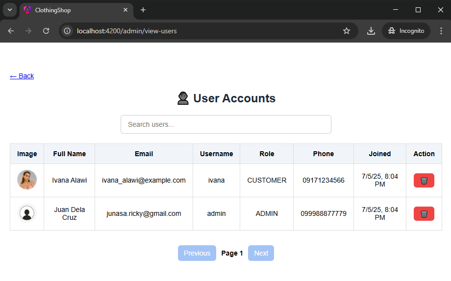
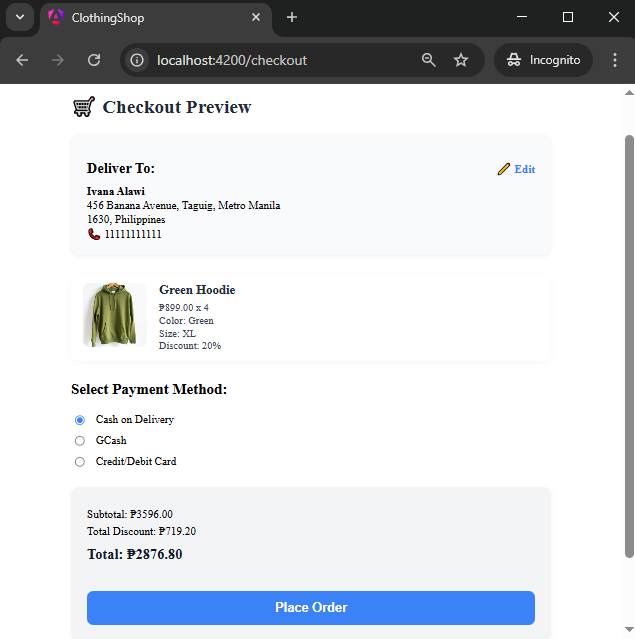

# Clothify E-Commerce

Clothify is a full-stack e-commerce web application built with Angular 17 on the frontend and Spring Boot on the backend. It allows users to browse clothing products, manage carts, place orders, and perform account operations. Admins can manage inventory and view customer orders. The application includes simulated GCash and Card payment flows, with backend-integrated order processing and session handling.

## Features

### 🛍️ User-Side Features
- User registration, login, and logout
- Profile update and password change
- Product listing with:
  - Discounts
  - Live search
- Add to Cart and Buy Now functionality
- Checkout with simulated GCash/Card payment selection
- Address selection during checkout
- Order history with:
  - Status badges (PENDING, PROCESSING, PACKED, OUT_FOR_DELIVERY, DELIVERED)
  - Address and payment details

### 🛠️ Admin-Side Features
- Login with admin credentials
- Product management (CRUD)
- View all orders placed by customers
- View user list and account details
- View sales and user metrics in dashboard format

### 💡 Technical Highlights
- Angular 17 with modular structure and responsive layout
- Spring Boot REST API with JPA/Hibernate
- MySQL for persistent storage
- Simulated payment flows (no real third-party integration)
- Session handling via `sessionStorage` to track cart, order, and payment data
- Fully responsive design for desktop and mobile views

## Technologies Used

- **Frontend**: Angular 17, SCSS, TypeScript
- **Backend**: Java (Spring Boot), Spring Security
- **Database**: MySQL
- **Email**: SMTP (Spring Mail)
- **Session**: Browser `sessionStorage` and JWT for auth
- **Payment Flow:** Simulated GCash & Card with backend integration
- **Hosting:** (Previously on Render — currently unavailable)
- **Build Tools**: Maven (backend), Angular CLI (frontend)

## Project Setup

### Backend
1. Clone the repository and navigate to the backend directory.
2. Configure your `application.properties` (set MySQL credentials, SMTP credentials).
3. Run the application using your IDE or `mvn spring-boot:run`.

### Frontend
1. Navigate to the Angular project directory.
2. Install dependencies:
   ```bash
   npm install

## 📸 Screenshots

> Note: Since the live demo is currently unavailable, here are screenshots showing key features of the app:

### Admin Interface




### User Interface 





